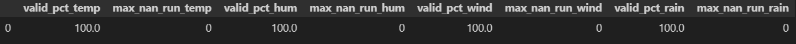
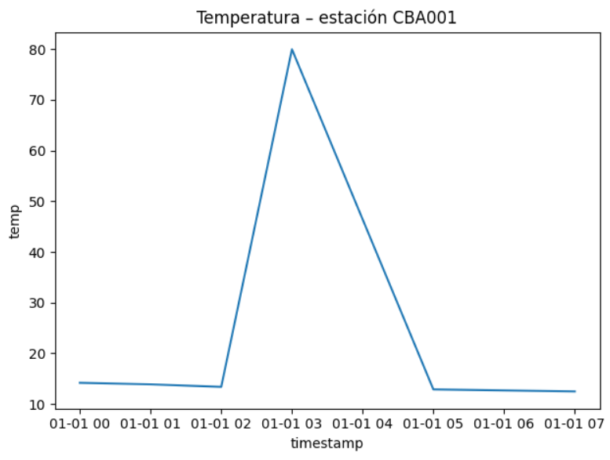

# AEMET Data Quality

Proyecto demostrativo de **calidad de datos meteorológicos** desarrollado en Python, con un enfoque reproducible y modular.  

Incluye ingestión de datos (CSV de ejemplo), limpieza de valores nulos, detección de *outliers* estadísticos (z-score), validación contra límites físicos y cálculo de KPIs clave.

------------------------------------------------------------------------------

## Objetivos

- Ingesta de datos desde CSV (simulación de datos meteorológicos de estación).
- Limpieza y tratamiento de valores nulos (interpolación, relleno, eliminación).
- Señalización de *outliers* estadísticos mediante z-score.
- Validación contra límites físicos por variable (temperatura, humedad, viento, lluvia).
- Cálculo de KPIs: % de valores válidos y racha máxima de nulos.
- Detección de *sensor drift* mediante media móvil.
- Visualización de series temporales.

------------------------------------------------------------------------------

## Estructura del proyecto

- **notebooks/**: cuadernos Jupyter con análisis, KPIs y gráficas.
- **src/**: código Python (utilidades, validaciones, visualizaciones).
- **data/raw** y **data/processed**: datos originales y procesados (no versionados).
- **sql/**: consultas SQL de calidad de datos.

------------------------------------------------------------------------------

## Resultados

- **KPIs**: % de válidos por variable y racha máxima de nulos.
- **Banderas**: outliers estadísticos (z-score), límites físicos y *sensor drift* (media móvil).
- **Visualización**: serie temporal de temperatura como ejemplo.




------------------------------------------------------------------------------

## Cómo reproducir


# 1. Clonar el repositorio
git clone https://github.com/TU_USUARIO/aemet-data-quality.git
cd aemet-data-quality

# 2. Crear entorno virtual e instalar dependencias
python -m venv .venv

# Activar entorno en Windows
. .venv\Scripts\Activate.ps1

pip install -r requirements.txt

# 3. Ejecutar el script principal
python main.py


------------------------------------------------------------------------------

## 📊 Uso del dashboard (Streamlit)

1. Ejecuta la app desde la **raíz del proyecto**:
   ```bash
   streamlit run streamlit_app.py
   ```

2. Abre el navegador en:
   👉 http://localhost:8501

---

### 🔧 ¿Qué hace el dashboard?
- **Carga datos** desde:
  - CSV de ejemplo incluido en `data/raw/sample_measurements.csv`.
  - Subida de CSV propia (desde la barra lateral).
- **Pipeline de calidad de datos**:
  - Tratamiento de **nulos** (`interpolate`, `ffill`, `bfill`, `drop`).
  - Detección de **outliers** con **z-score** (umbral ajustable).
  - Chequeo de **límites físicos** (p. ej., **humedad < 0% o > 100%**).
  - Detección de **drift** (cambios bruscos por ventana deslizante).
- **Resultados mostrados**:
  - **KPIs por variable** (% válidos, racha máxima de nulos, nº de filas).
  - **NO válidos**: conteo global y desglose por columna (**n_null**, **n_outliers**, **n_phys**).
  - **Series temporales interactivas** (si existe columna `timestamp`).
  - **Descarga de CSV procesado**.

---

### 🖱️ Uso recomendado
- En la **barra lateral**:
  - Selecciona la **fuente de datos** (CSV ejemplo o subir CSV).
  - Elige el **método de nulos** y el **umbral z-score**.
  - Indica la **columna para drift** (p. ej., `temp`) y su **ventana**.
  - Selecciona las **columnas numéricas** a validar (p. ej., `temp`, `hum`, `wind`, `rain`).
- En el **área principal**:
  - Revisa KPIs y el **desglose de NO válidos** (incluye humedades negativas).
  - Visualiza series temporales.
  - Descarga el **CSV procesado**.

---

### 📦 Requisitos mínimos
- Python 3.9+
- Paquetes (incluidos en `requirements.txt`):
  - `streamlit`
  - `pandas`
  - `numpy`
